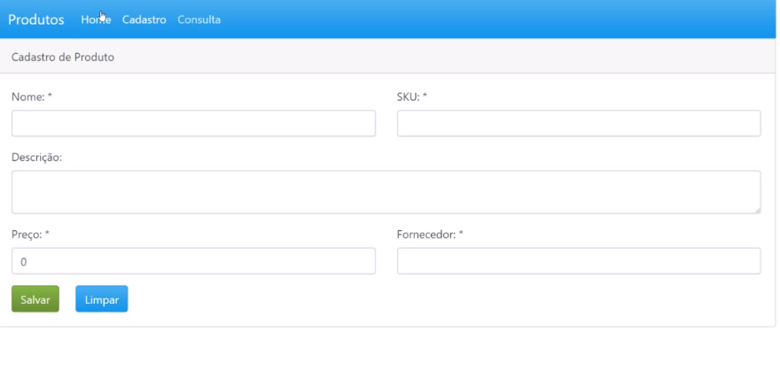

# <h3 align="center">CRUD USING REACT</h3>

   Home
     
     
    
     
     
    Register
     
     
     
    
 ## Build with
* [REACT]()
* [BOOTSTRAP]()

## Usage
CRUD in Bootstrap.Based in a store system.

## Architecture:
* Home
* Register
* Update

## Getting Started

git clone https://github.com/SthefanneBatista/crud-react/
